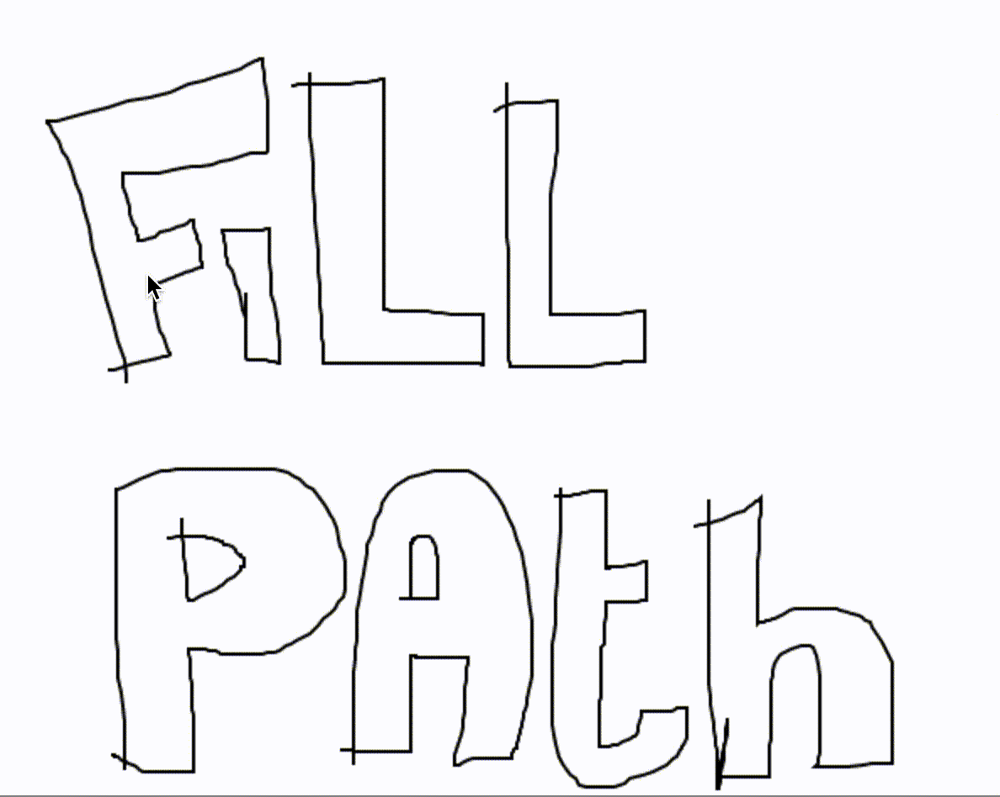

# Fill Path
Vector based fill tool (like floodfill) build with [Clipper](https://www.npmjs.com/package/clipper-lib)



# Usage
Include `fillPath` in your project. `fillPath` accepts two arguments, `paths` and `point`.

```javascript
fillPath( Paths, Point );

Paths = [...[...Point];
Point = { x: Number, y: Number };
```
Note: the `Point` argument gets rounded because `Clipper` needs `IntPoint` for polygon collision.

Include `fill-path`

Using JSPM
```javascript
import fillPath from 'Doodle3D/fill-path';
```

Using NPM
```javascript
const fillPath = require('fill-path');
```

Example code
```javascript
const paths = [rect(0, 0, 30, 30), rect(10, 10, 10, 10)];
const result = fillPath(paths, { x: 5, y: 5 });

// result = [ [
//   { x: 1, y: 1 },
//   { x: 1, y: 29 },
//   { x: 29, y: 29 },
//   { x: 29, y: 1 }
// ], [
//   { x: 21, y: 10 },
//   { x: 21, y: 20 },
//   { x: 20, y: 21 },
//   { x: 10, y: 21 },
//   { x: 9, y: 20 },
//   { x: 9, y: 10 },
//   { x: 10, y: 10 },
//   { x: 10, y: 9 },
//   { x: 20, y: 9 }
// ] ]

function rect(x, y, w, h) {
  return [
    { x, y },
    { x: w + x, y },
    { x: w + x, y: h + y },
    { x, y: h + y },
    { x, y }
  ];
}
```

# Installation

Using NPM
```
npm install fill-path
```

using JSPM
```
jspm install github:Doodle3D/fill-path
```

# Clone Project
```
git clone git@github.com:Doodle3D/fill-path.git
cd fill-path
npm install
jspm install
```

# Test
```
npm run test
```

# Example
```
npm run example
```
